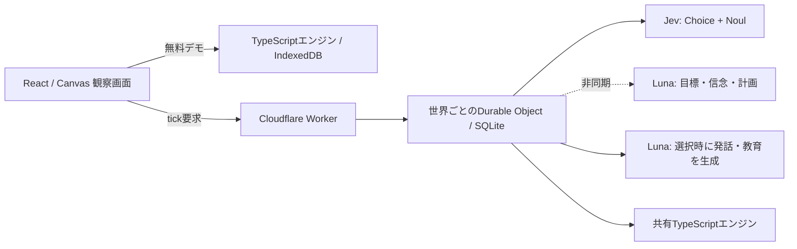

# Terrarium Web — アーキテクチャ

更新日: 2026-09-18。起動手順は [README](../README.md)、機能と未移植項目は [現行仕様](spec.md) を参照。

## 構成

ReactとCanvasが観察画面を構成し、描画から独立したTypeScriptエンジンをブラウザのデモとWorkerで共有する。AIキーはWorkerの環境変数だけから取得する。

ViteのCloudflareプラグインにより、開発時もWorkerとDurable Objectをローカルで動かす。デプロイは不要。現在の公開環境は削除済み。

## コードの責務

| 場所 | 責務 |
| --- | --- |
| `src/App.tsx` | 操作、世界の切替、tick要求、履歴、JSON入出力 |
| `src/components/` | 世界、個体、関係・家系の表示 |
| `src/game/` | Canvas描画、時間帯・天気 |
| `src/i18n/` | 日英辞書、読みやすい名前、表示用変換 |
| `src/simulation/` | 世界、行動、物理、認知、デモ、読み込み検証 |
| `src/storage.ts` | ブラウザのIndexedDB |
| `worker/ai.ts` | Jev / Luna、スキーマ、利用量 |
| `worker/index.ts` | API、認証、quota、世界の実行、SQLite |
| `worker/snapshots.ts` | スナップショットの分割と履歴上限 |

## 世界の一貫性

- 1つのAI世界を1つのDurable Objectが保持する。同じ世界のtick処理中に来た別のtick要求は拒否。
- `expectedTick` が一致しない場合は現在状態を返し、重複適用しない。
- 全個体の観測を固定して判断し、必要な発話本文もそろえてからID順に適用する。
- API到着順で物理結果を変えない。実行時に対象の生死・位置・資源を再検証する。
- 生まれた子は次tickから参加する。行動が失敗しても、そのtickの基礎代謝は進む。
- `availableActions` / `destination` を候補列挙と実行で共有する。候補生成は状態・乱数を変えない。
- 生殖・資源再生の乱数状態も保存する。同じ選択・世界・乱数状態なら同じ結果になる。AIの選択自体の再現性は保証しない。

## tickの要求と待ち時間

ブラウザの再生タイマーだけが自動tickを要求する。サーバーの常時タイマー・周期alarm・永続WebSocketはない。タブ非表示、設定画面、履歴表示、停止中は自動要求を止める。送信済みの処理は完了し得る。

1倍の要求間隔は1,500ms。AIモードでは750msより短くしない。処理中は次の要求を重ねず、遅延分をまとめて消化もしない。

**発話・教育は同期**。Jevが選んだ場合だけLunaに依頼し、そのtickの全判断と言葉を待つ。言葉の生成がtickのボトルネックになり得る。目標・信念・計画の**熟考は非同期**で、完了をtick境界で反映する。詳細は [認知処理](jev-cognition-design.md)。

## APIと設定

| API | 用途 |
| --- | --- |
| `GET /api/status` | 接続設定の有無、認証要否、日次上限。秘密値は返さない |
| `POST /api/worlds` | 名前・シード・初期人口・知能モード・言語から世界を作成 |
| `GET /api/worlds/:id` | 現在状態 |
| `POST /api/worlds/:id/tick` | `expectedTick` と言語を指定して1 tick進める |
| `GET /api/worlds/:id/history` | 直近の保存履歴 |

世界作成APIは任意の初期パラメータ編集APIではない。UIが渡す人口は10 / 20 / 30 / 40人で、サーバー側は2〜40人に制限する。

Web版の基本設定は `src/simulation/world.ts`。`data/config.json` の `costs` 数値項目を取り込み、その他の旧設定は自動移行しない。`data/config.local.json` は実行設定として読まない。`tools/import-secrets.mjs` だけが旧ファイル内のTypeSafe / OpenAIキーを `.dev.vars` へコピーする。

## 保存

| 対象 | 保存先 |
| --- | --- |
| デモの世界 | ブラウザのIndexedDB |
| AIの世界・長期記憶・イベント | 世界ごとのSQLite Durable Object |
| AIの最後に受信した状態 | ブラウザにもキャッシュ |
| ローカル開発のDurable Object | `.wrangler/` 配下 |
| 言語・天気などの表示設定 | ブラウザのローカル保存 |
| 観察室の合言葉 | ブラウザのセッション保存 |

スナップショットはUTF-8のバイト列を512 KiBに分割し、SQLiteの行サイズ制限を避ける。記憶・イベントと同じトランザクションで保存し、最新状態から復元する。

サーバーは直近120 tick、一括取得は最新側から8 MiBまで。ブラウザの巻き戻しは最新80件・4 MiBを上限にする。長期記憶・イベントは保持するため、長期運用では保存容量が増える。

JSONはWeb版v2の現在状態。読み込みでは内容を検証し、思考中状態を破棄して新しいIDのローカルデモにする。AIサーバーへの復元や旧Godot DBの自動変換はない。

## 認証・配備・費用

ローカル開発では `.dev.vars`、公開環境ではWrangler Secretから `TYPESAFE_API_KEY` / `OPENAI_API_KEY` を取得する。`VITE_` 変数へ入れない。設定ファイル・保存データ・ビルド出力はGit管理外にする。

公開環境の世界APIは `ADMIN_TOKEN` の合言葉で保護する。未設定なら公開環境での操作を拒否し、localhost開発時だけ合言葉なしを許可する。利用者別のアカウント管理・権限分離は実装していない。

配備する場合は所有者にアカウント名・ID・環境を確認する。静的アセットとAPIを1 Workerにまとめ、永続化はSQLite Durable Objectを使う。D1 / R2 / Queuesは使わない。

`MAX_AI_TICKS_PER_DAY`（既定500）でデプロイ全体のAI tick要求を日次集計し、失敗・競合も数える。世界ごとの同時熟考は2件、再考間隔は既定5 tick。外部APIのタイムアウト・再試行上限とWorkerのCPU上限を設定する。

これらは請求額の上限ではない。TypeSafe / OpenAIの利用料はCloudflareと別で、人口・記憶・生成量によって変わる。画面は実装済みの単価による推定を表示し、未知のモデルは未集計とする。

## 移植の限界と検証

旧版の初期パラメータ編集、地形編集、初期条件と実行を分けた管理、旧DB移行は未移植。長期バランス調整も残っており、元気不足で生殖候補が出ないケースを確認している。Godotコードと旧資料はGitコミット `5d3e248` から参照できる。

`npm test` は候補列挙、移動・隣接・資源、出生、観測の隔離、APIの構造化応答と費用、古い熟考の棄却、継続実行、JSON復元、履歴分割、日英表示を検証する。API応答はテストではモックする。`npm run build` で型とクライアント / Workerのビルドを確認する。
